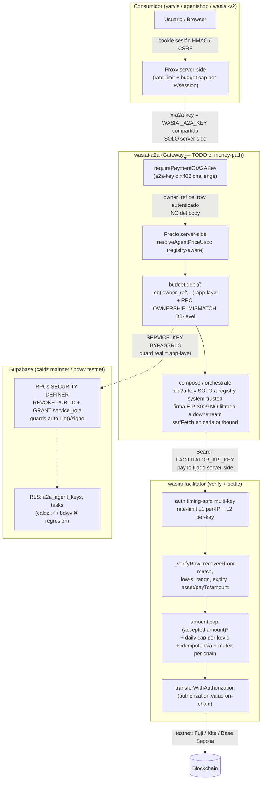

# Auditoría Delta de Seguridad — Ecosistema WasiAI

**Fecha:** 2026-07-02
**Alcance:** wasiai-a2a, wasiai-facilitator, wasiai-v2, yarvis, wasiai-agentshop
**Modalidad:** propose-only (ningún fix aplicado/commiteado); verificación en vivo read-only ejecutada.
**Consolidador:** delta-audit-consolidator

---

## 1. Resumen ejecutivo

- **28 hallazgos previos verificados**: 27 siguen cerrados (✅), 1 regresión parcial (⚠️), 0 no verificables (la introspección en vivo desbloqueó los pendientes de DB).
- La **verificación en vivo (Supabase Management API, read-only) se ejecutó sin bloqueo** en caldz (mainnet) y bdwv (testnet).
- **caldz (mainnet): todos los controles cerrados** — grants de las 9 RPCs financieras = solo `postgres` + `service_role`; `increment_agent_key_spend` dropeada; RLS `true` en `tasks` y `a2a_agent_keys`.
- **bdwv (testnet): regresión de defensa en profundidad** — RLS **DESHABILITADA** (`relrowsecurity=false`) en `tasks` y `a2a_agent_keys` (se esperaba `true`). El guard app-layer `.eq('owner_ref',...)` sigue siendo la defensa primaria y está presente; RLS es solo profundidad.
- **13 hallazgos nuevos**: 1 ALTO, 3 MEDIO, 4 BAJO, 5 informativos.
- **Riesgo #1 (ALTO):** `escrow_transactions` (v2) con RLS `FOR ALL USING(true)` sin `TO service_role` + default-ACL → IDOR/tamper del bookkeeping de settlement vía PostgREST directo.
- **Riesgo #2 (MEDIO, cross-repo):** el cap por-settle del facilitator acota `accepted.amount` pero **no** `authorization.value` → monto liquidado on-chain no topado.
- **Riesgo #3 (MEDIO):** rutas de compose de agentshop (`/api/kyc|/discover|/match`) sin auth/CSRF/rate-limit → budget-drain del `A2A_KEY` compartido.
- Settlement sigue siendo **testnet** (Avalanche Fuji / Kite / Base Sepolia). Storage: solo wasiai-v2 usa buckets (gated por admin EIP-712).

---

## 2. Verificación de hallazgos previos

| ID | Repo | Descripción | Estado declarado | Estado verificado | Evidencia |
|----|------|-------------|------------------|-------------------|-----------|
| M3 | facilitator | Daily settle cap particionado por keyId (anti-DoS cross-tenant) | sigue_cerrado | ✅ sigue cerrado (código) | `src/core/settle-cap.ts:111-114` key `settle:daily:<date>:<keyId>`; `settle.ts:206-211`; `auth.ts:122` |
| C1 | a2a | compose no reenvía `x-a2a-key` salvo registry system-trusted | sigue_cerrado | ✅ sigue cerrado (código) | `compose.ts:778-781`; `registries.ts:166-178`; `registry.ts:46` |
| C2 | a2a | No filtra firma EIP-3009 del operador a downstream | sigue_cerrado | ✅ sigue cerrado (código) | `compose.ts:816-830`, settle propio `918-926` |
| H1 | a2a | step-0 facturado dual-ledger + credit-back simétrico | sigue_cerrado | ✅ sigue cerrado (código) | `orchestrate.ts:918,970-978,1145-1166`; `a2a-key.ts:629` |
| H3 | a2a | `trustProxy` configurable (rate-limit no DoSable) | sigue_cerrado | ✅ sigue cerrado (código) | `index.ts:65`; `env.ts:54-74`; test `env.test.ts:102-127` |
| M1 | a2a | refund revierte parent + total_spent/spent_usd | sigue_cerrado | ✅ sigue cerrado (código) | `budget.ts:494-540,547-593`; `orchestrate.ts:1145-1166,1190` |
| P1 | a2a | precio step-0 registry-aware (anti-slug-decoy) | sigue_cerrado | ✅ sigue cerrado (código) | `orchestrate.ts:621-627,785`; `agent-price.ts:19-23` |
| P2 | a2a | delimitación anti-prompt-injection en transform LLM | sigue_cerrado | ✅ sigue cerrado (código) | `llm/transform.ts:137-158` |
| #151 | a2a | guard de relevancia (no cobra step-0 sin agentes relevantes) | sigue_cerrado | ✅ sigue cerrado (código) | `orchestrate.ts:701-767` |
| #152 | a2a | goals zero-token fuerzan no_relevant_agent | sigue_cerrado | ✅ sigue cerrado (código) | `orchestrate.ts:704,311-318` |
| #153 | a2a | precondition-gate agents temprano | sigue_cerrado | ✅ sigue cerrado (código) | commit `250d64d` en HEAD |
| owner_ref invariant | a2a | filtro app-layer `.eq('owner_ref',...)` en services/rutas | sigue_cerrado | ✅ sigue cerrado (código) | `budget.ts:52`; `compose.ts:239`; `orchestrate.ts:977`; `a2a-key.ts:906/915`; `identity.ts:116,144,182`; `task.ts:102,126,168,218` |
| RLS a2a (Postgres) | a2a | ENABLE RLS en `a2a_agent_keys`/`tasks` (profundidad) | no_verificable_sin_db | ⚠️ **regresión parcial (en vivo)** | **caldz ✅ `true`/`true`; bdwv ❌ `false`/`false`** (ver §6) |
| CVE-2025-29927 | v2 | bypass middleware Next.js | sigue_cerrado | ✅ sigue cerrado (código) | Next 16.2.9; auth por-route (`middleware.ts:25-33`) |
| C3 | v2 | `check_and_deduct_budget` REVOKE + bound de signo | no_verificable_sin_db | ✅ **cerrado por verificación en vivo** | grants caldz+bdwv = `postgres, service_role`; guard `p_amount<0` en migración |
| C4 | v2 | `increment_key_budget` REVOKE + ownership | no_verificable_sin_db | ✅ **cerrado por verificación en vivo** | grants caldz+bdwv = `postgres, service_role` |
| C5 | v2 | `increment_pending_earnings` REVOKE + ownership | no_verificable_sin_db | ✅ **cerrado por verificación en vivo** | grants caldz+bdwv OK; `decrement_*` idem |
| H2 | v2 | `increment_agent_key_spend` dropeada | no_verificable_sin_db | ✅ **cerrado por verificación en vivo** | ausente en `pg_proc` en caldz **y** bdwv |
| M2 | v2 | `deduct/refund_sandbox_balance` REVOKE + ownership | no_verificable_sin_db | ✅ **cerrado por verificación en vivo** | grants caldz+bdwv OK |
| MAINNET-REVOKE | v2 | REVOKE aplicado a caldz + `claim_refund` | no_verificable_sin_db | ✅ **cerrado por verificación en vivo** | `claim_refund` grants caldz+bdwv = `postgres, service_role` |
| H5 | v2 | SSRF DNS-rebinding TOCTOU (onboard/step) | sigue_cerrado | ✅ sigue cerrado (código) | `onboard/step/route.ts:85`; `fetchPinned.ts:59-103` |
| H6 | v2 | SSRF TOCTOU + relay Authorization (test-endpoint) | sigue_cerrado | ✅ sigue cerrado (código) | `creator/test-endpoint/route.ts:39,44-45,49,83,91-96` |
| H4 | yarvis | /api/plan,/execute con auth+RL+budget+cache bound | sigue_cerrado | ✅ sigue cerrado (código) | `plan/route.ts:28-44`; `execute/route.ts:37-99`; `ttl-lru.ts:16-72` |
| FIX-CAPS | yarvis | defaults anti-rotación 2.0/20/5 | sigue_cerrado | ✅ sigue cerrado (código) | `rate-limit.ts:41,53,63`; `proxy.ts:37` |
| FIX-DONECARD | yarvis | recibo de remesa (no KYC crudo) | sigue_cerrado | ✅ sigue cerrado (código) | `yarvis-chat.tsx:132-141` |
| M3 (agentshop) | agentshop | /api/settle auth+RL+re-derive server-side | sigue_cerrado | ✅ sigue cerrado (código) | `settle/route.ts:15,20,38`; `settle-guard.ts:108-121,201-209`; `run-settle.ts:37-52` |
| AGENTSHOP-BEARER | agentshop | Bearer FACILITATOR_API_KEY al /settle | sigue_cerrado | ✅ sigue cerrado (código) | `facilitator-client.ts:119-121,68,92`; `env.ts:20` |
| CVE-2025-29927 | agentshop | bypass middleware Next.js | no_encontrado (N/A) | ✅ N/A (sin middleware) | `find`: no `middleware.ts`; sin superficie |

**Nota DB:** los ✅ de C3/C4/C5/H2/M2/MAINNET-REVOKE quedan cerrados **por verificación en vivo** (grants reales en caldz+bdwv), complementando el control de código (migraciones). El único ⚠️ es la RLS de a2a en bdwv (ver §6).

---

## 3. Hallazgos nuevos por severidad

| # | Severidad | Área | Repo | Hallazgo | Evidencia archivo:línea | Parche |
|---|-----------|------|------|----------|--------------------------|--------|
| N1 | **ALTO** | RLS / IDOR money-path | wasiai-v2 | Política `service_all` en `escrow_transactions` es `FOR ALL USING(true) WITH CHECK(true)` **sin `TO service_role`** → aplica a PUBLIC; con el default-ACL del proyecto, anon/authenticated pueden leer TODOS los escrows y hacer INSERT/UPDATE/DELETE sobre bookkeeping de settlement vía PostgREST directo | `034_escrow.sql:34-37`; contraste correcto `017_pipeline_executions.sql:57`; default-ACL `20260702010000_...:8-18`; consumo `internal/escrow/release-expired/route.ts:39-74` | Sí |
| N2 | **MEDIO** | Money-path / amount cap | wasiai-facilitator | `SETTLE_MAX_AMOUNT_ATOMIC` acota `parsed.accepted.amount` pero la transferencia mueve `authorization.value`; `verify` solo cota `value` por abajo → cap bypasseable, no acota el monto liquidado on-chain | `settle.ts:43`; `base-adapter.ts:538,617`; `settle.ts:265` | Sí |
| N3 | **MEDIO** | RLS / integridad reputación | wasiai-v2 | `ratings_service_insert/update` en `agent_ratings` sin `TO service_role` → anon/authenticated pueden INSERT/UPDATE ratings vía PostgREST, bypassear dedup/rate-limit y (via trigger) inflar/hundir `reputation_score` | `0011_agent_ratings.sql:22-27,72`; ruta legítima `models/[slug]/rate/route.ts:31-49`; default-ACL `20260702010000` | Sí |
| N4 | **MEDIO** | Money-path / endpoints públicos compose | wasiai-agentshop | `/api/kyc`, `/api/discover`, `/api/match` sin auth/CSRF/rate-limit ni zod; con `A2A_KEY` seteado y no demo-mode disparan `composeOnA2A` → debitan budget del `A2A_KEY` compartido | `kyc/route.ts:5-11`; `discover/route.ts:5-11`; `match/route.ts:5-16`; `run-kyc.ts:25,45`; `a2a-client.ts:44` | Sí |
| N5 | BAJO | Money-path / cold-path fallback | wasiai-a2a | `budget.debit()` branches dest-policy y master mantienen fallback (`ownerRef===undefined`) que hace `SELECT owner_ref ... WHERE id=keyId` sin filtrar owner_ref y alimenta ese owner al RPC → guard OWNERSHIP_MISMATCH tautológico. Dead code hoy (todos los call-sites autenticados threadean owner_ref); footgun futuro | `budget.ts:270-282,325-338` | Sí |
| N6 | BAJO | Autz destino /settle (residual) | wasiai-facilitator | Allowlist de `payTo` es opt-in y global (per-key diferido DEFER-TO-HU); con `FACILITATOR_PAYTO_ALLOWLIST` unset, cualquier key válida liquida a cualquier receiver | `payto-allowlist.ts:5-8,61-64`; `settle.ts:78-82,128`; `env.ts:102-108` | No (residual aceptado) |
| N7 | BAJO | Rate-limit serverless | yarvis | Caps de rate/budget en Maps de módulo (single-instance); en Vercel multi-instancia el cap efectivo per-IP/per-session se multiplica por ~N. Backstop real = budget prepago del key en el gateway | `rate-limit.ts:1-12,87-88`; `plan-cache.ts:34` | No (documentado) |
| N8 | BAJO | Budget cap ante cache-miss | yarvis | En /api/execute con cache-miss, `maxQuotedCostUsdc` sale del body del browser; `consumeBudget` hace `safeAmount=0` si `<=0` → cliente puede enviar 0 y no incrementar el cap. Acotado: a2a re-valida quote (QUOTE_STALE) | `execute/route.ts:71-73,81,93,26`; `rate-limit.ts:130` | No (documentado) |
| N9 | INFO | Dead code divergente (settle) | wasiai-facilitator | `methods/eip3009/{settle,verify}.ts` no se importan en runtime; difieren del path vivo (`base-adapter` no hace recover+from-match, delega a on-chain). No explotable, invita a re-cablear la ruta equivocada | grep runtime; `base-adapter.ts:586-687`; `methods/eip3009/settle.ts:56` | No |
| N10 | INFO | /metrics + CORS default | wasiai-facilitator | `/metrics` sin auth ni rate-limit expone estado de circuit-breakers; CORS refleja cualquier Origin si `CORS_ALLOWED_ORIGINS` unset (credentials:false, sin CSRF real) | `metrics.ts:6-7,25`; `app.ts:266-294,242-249` | No |
| N11 | INFO | /metrics fail-open | wasiai-a2a | `/metrics` abre sin auth si `METRICS_TOKEN` unset (aun en prod), a diferencia de `/dashboard` fail-closed. Contenido = agregados Prometheus sin PII/budgets | `metrics.ts:133-135`; contraste `dashboard.ts:37` | No |
| N12 | INFO | Rate-limit robustez | wasiai-agentshop | Rate-limit de /settle in-memory fixed-window (MNR-1/MNR-2), no sobrevive fan-out serverless, bucketea por XFF spoofeable; cap on-chain `ONCHAIN_AMOUNT_CAP_PYUSD=0.5` es el límite duro | `settle-guard.ts:124-155` | No |
| N13 | INFO | CVE-2025-29927 N/A | yarvis | Next `^16.0.0` no vulnerable; auth re-verificada en handlers (defense-in-depth). Cierre de foco | `package.json`; `proxy.ts:20-54`; `plan/route.ts:28-31`; `execute/route.ts:37-40` | No |

---

## 4. Parches propuestos (propose-only — NO aplicados; para dev → AR/CR)

### N1 — escrow_transactions RLS (ALTO)

**Por qué:** `FOR ALL USING(true)` sin `TO service_role` hace la política aplicable a PUBLIC; combinado con el default-ACL del proyecto (que otorga privilegios de tabla a anon/authenticated) cualquier caller lee/muta el bookkeeping de settlement vía PostgREST directo, saltándose las rutas server-side. La política permisiva es aditiva (OR) sobre `payer_read`, por lo que también rompe el aislamiento por payer.

```sql
-- migración nueva, p.ej. 20260703000000_fix_escrow_rls.sql (PROPUESTA)
DROP POLICY IF EXISTS "service_all" ON escrow_transactions;
CREATE POLICY "service_all" ON escrow_transactions
  FOR ALL TO service_role USING (true) WITH CHECK (true);
REVOKE ALL ON escrow_transactions FROM anon, authenticated;
-- Si se quiere SELECT propio vía cliente: GRANT SELECT ON escrow_transactions TO authenticated;
-- (payer_read se mantiene para el SELECT del dueño)
```

**Cómo validar (read-only, sin mutar):** con anon/authenticated key contra PostgREST, `POST /rest/v1/escrow_transactions` y `GET /rest/v1/escrow_transactions?select=*` deben devolver 401/permission-denied o solo filas propias; con service_role sigue funcionando. Confirmar en `information_schema.table_privileges` que anon/authenticated ya no tienen INSERT/UPDATE/DELETE y en `pg_policies` que `service_all` tiene `roles={service_role}`.

### N2 — facilitator amount cap sobre authorization.value (MEDIO)

**Por qué:** el cap documentado como protección contra "single-tx drain" solo inspecciona `accepted.amount`, pero lo que se mueve on-chain es `authorization.value`. Un caller con key válida + firma EIP-3009 sobre un value inflado declara `accepted.amount <= cap` (pasa) mientras `transferWithAuthorization` ejecuta el value mayor.

```diff
  // src/core/settle.ts Step 0
  if (options?.maxAmountAtomic !== undefined) {
-   const capCheck = checkSettleAmountCap(parsed.accepted.amount, options.maxAmountAtomic);
-   if (!capCheck.ok) { ... }
+   // el cap debe acotar el value on-chain, que es lo que realmente se mueve
+   const valueCheck = checkSettleAmountCap(parsed.payload.authorization.value, options.maxAmountAtomic);
+   if (!valueCheck.ok) {
+     return { ok: false, error: buildX402Error('INVALID_AMOUNT', `authorized value exceeds per-settle cap (${valueCheck.limit.toString()} atomic units)`) };
+   }
+   const capCheck = checkSettleAmountCap(parsed.accepted.amount, options.maxAmountAtomic);
+   if (!capCheck.ok) { return { ok:false, error: buildX402Error('INVALID_AMOUNT', `amount exceeds per-settle cap (${capCheck.limit.toString()} atomic units)`) }; }
  }
```

**Cómo validar:** test con `accepted.amount = cap` y `authorization.value = cap+1` → hoy pasa Step 0 y llega al adapter; con el fix devuelve `INVALID_AMOUNT` 400 antes de tocar la cadena.

### N3 — agent_ratings RLS (MEDIO)

**Por qué:** políticas insert/update sin `TO service_role` → PostgREST directo permite falsear ratings y (via trigger `update_agent_reputation`) manipular el Reputation Registry usado en discovery.

```sql
-- migración nueva (PROPUESTA)
DROP POLICY IF EXISTS "ratings_service_insert" ON agent_ratings;
DROP POLICY IF EXISTS "ratings_service_update" ON agent_ratings;
CREATE POLICY "ratings_service_insert" ON agent_ratings FOR INSERT TO service_role WITH CHECK (true);
CREATE POLICY "ratings_service_update" ON agent_ratings FOR UPDATE TO service_role USING (true);
REVOKE INSERT, UPDATE, DELETE ON agent_ratings FROM anon, authenticated;
-- ratings_public_read se mantiene para discovery
```

**Cómo validar:** con anon/authenticated, POST/PATCH a `/rest/v1/agent_ratings` debe fallar; el flujo por `/api/v1/models/[slug]/rate` (service_role) sigue OK; SELECT público OK.

### N4 — agentshop rutas de compose (MEDIO)

**Por qué:** misma clase que M3/H4 pero sin cubrir; endpoints públicos disparan débito del `A2A_KEY` compartido.

**Propuesta:** reusar el guard de settle en las tres rutas: (1) `checkRateLimit`/`getClientIp` de `@/infra/settle-guard` antes de `runKyc/discover/match` → 429 con Retry-After; (2) check same-origin/CSRF (Origin/Referer contra allowlist env-driven, porque se llaman mismo-origen — un Bearer rompería la demo); (3) validar body con zod (`remittanceSchema` ya existe). Alternativa dura: si `!isDemoMode() && A2A_KEY`, exigir Bearer `SETTLE_API_SECRET` + Server Action.

**Cómo validar:** con `NEXT_PUBLIC_DEMO_MODE` unset y `A2A_KEY` seteado, `for i in $(seq 1 20); do curl -sS -XPOST $HOST/api/kyc -d '{...}'; done` debe cortar en 429; un Origin ajeno → 403.

### N5 — a2a budget cold-path fallback (BAJO)

**Por qué:** el fallback sin owner_ref vuelve tautológico el guard OWNERSHIP_MISMATCH; dead code hoy pero footgun.

**Propuesta:** hacer `ownerRef` obligatorio (`string`, no `string | undefined`) en la firma de `debit()` y eliminar ambos SELECT cold-path (mismo criterio que `credit`/`creditWithDest`).

**Cómo validar:** (a) type-check debe fallar en cualquier call-site sin ownerRef; (b) correr `budget.test.ts` + money-path concurrency/resilience; (c) confirmar que los 4 call-sites de prod (compose.ts:239, orchestrate.ts:977, a2a-key.ts:906/915) pasan.

**Residuales sin parche (N6–N13):** ver §3; recomendaciones operativas — setear `FACILITATOR_PAYTO_ALLOWLIST` (N6), mover caps a Upstash/Redis compartido antes de mainnet (N7/N8/N12), restringir `/metrics` a red interna + CORS explícito (N10/N11), borrar/documentar `methods/eip3009/*` (N9).

---

## 5. Fronteras de confianza (cross-repo)

Flujo completo de una transacción (solicitud → challenge x402 → verificación → débito/entrega):



**Qué valida cada borde:**

1. **Consumidor → borde propio:** yarvis y agentshop-settle validan auth (cookie sesión / Bearer `SETTLE_API_SECRET`), rate-limit y budget cap per-caller ANTES de tocar el gateway. **Gap N4:** las rutas de compose de agentshop (`/api/kyc|/discover|/match`) NO validan nada — delegan toda la confianza al gateway. El `WASIAI_A2A_KEY` nunca cruza al browser (solo server-side).

2. **Consumidor → a2a:** el gateway asume que el caller ya pasó su propio auth; los consumidores comparten un `WASIAI_A2A_KEY` y deben protegerlo. Toda credencial `x-a2a-key` recibida NO se reenvía a downstream de terceros (solo a registries `owner_ref==='system'`).

3. **a2a (interno):** precio SIEMPRE server-side; `owner_ref` del débito/refund proviene del row autenticado (`request.a2aKeyRow.owner_ref`), no del body; guard app-layer `.eq('owner_ref',...)` + RPC `OWNERSHIP_MISMATCH` DB-level; SSRF revalidado por fetch. La firma EIP-3009 se genera y liquida en a2a, nunca se entrega copia redimible al agente.

4. **a2a → facilitator:** Bearer `FACILITATOR_API_KEY` obligatorio; `payTo` fijado server-side por el consumidor. El facilitator **NO valida owner_ref** (invariante de a2a) — confía en que a2a ya autorizó/presupuestó.

5. **facilitator (interno):** verificación EIP-3009 completa (recover+from-match, malleability, rango, expiry, asset/payTo/amount); rate-limit doble; daily cap particionado por keyId; idempotencia + mutex per-chain; nonce on-chain como salvaguarda última. **Gap N2 (\*):** el amount cap acota `accepted.amount`, **no** `authorization.value` — si a2a asume que el facilitator topa el monto liquidado, la suposición es FALSA. **Gap N6:** sin allowlist configurado, liquida a cualquier `payTo`.

6. **facilitator → blockchain:** settlement testnet; `transferWithAuthorization` revierte firmas inválidas (SIMULATION_FAILED).

7. **a2a/v2 → DB:** el cliente usa `SERVICE_KEY` (BYPASSRLS) → la defensa REAL es el filtro app-layer + los REVOKE/guards de las RPCs (verificados en vivo). **RLS es defensa en profundidad**, con la regresión N/A-a-explotable en bdwv (§6). **Gaps N1/N3 (v2):** `escrow_transactions` y `agent_ratings` NO están protegidas ni por REVOKE ni por políticas `TO service_role` — a diferencia de las RPCs financieras.

---

## 6. Verificación en vivo (catálogo)

**Modalidad:** introspección read-only vía Supabase Management API. Token leído en proceso desde `.env`, nunca escrito ni reimpreso. Sin SELECT a tablas de datos, sin mutaciones/DDL. **No bloqueado.**

### caldz (mainnet) — TODOS PASS ✅

| Objeto | Esperado | Actual | Pass |
|--------|----------|--------|------|
| rpc `check_and_deduct_budget` grants | postgres + service_role | postgres, service_role | ✅ |
| rpc `increment_key_budget` grants | postgres + service_role | postgres, service_role | ✅ |
| rpc `increment_pending_earnings` grants | postgres + service_role | postgres, service_role | ✅ |
| rpc `decrement_pending_earnings` grants | postgres + service_role | postgres, service_role | ✅ |
| rpc `deduct_sandbox_balance` grants | postgres + service_role | postgres, service_role | ✅ |
| rpc `refund_sandbox_balance` grants | postgres + service_role | postgres, service_role | ✅ |
| rpc `claim_refund` grants | postgres + service_role | postgres, service_role | ✅ |
| rpc `refund_delegation_and_parent` grants | postgres + service_role | postgres, service_role | ✅ |
| rpc `refund_session_and_parent` grants | postgres + service_role | postgres, service_role | ✅ |
| rpc `increment_agent_key_spend` existencia | NO existe (dropeada) | ausente en pg_proc | ✅ |
| rls `tasks` | relrowsecurity=true | true | ✅ |
| rls `a2a_agent_keys` | relrowsecurity=true | true | ✅ |

### bdwv (testnet) — grants OK, RLS ❌

| Objeto | Esperado | Actual | Pass |
|--------|----------|--------|------|
| rpc `check_and_deduct_budget` grants | postgres + service_role | postgres, service_role | ✅ |
| rpc `increment_key_budget` grants | postgres + service_role | postgres, service_role | ✅ |
| rpc `increment_pending_earnings` grants | postgres + service_role | postgres, service_role | ✅ |
| rpc `decrement_pending_earnings` grants | postgres + service_role | postgres, service_role | ✅ |
| rpc `deduct_sandbox_balance` grants | postgres + service_role | postgres, service_role | ✅ |
| rpc `refund_sandbox_balance` grants | postgres + service_role | postgres, service_role | ✅ |
| rpc `claim_refund` grants | postgres + service_role | postgres, service_role | ✅ |
| rpc `increment_agent_key_spend` existencia | NO existe (dropeada) | ausente en pg_proc | ✅ |
| rls `tasks` | relrowsecurity=true | **false** | ❌ |
| rls `a2a_agent_keys` | relrowsecurity=true | **false** | ❌ |

**Notas:** `refund_delegation_and_parent`/`refund_session_and_parent` son caldz-only por spec → ausencia en bdwv = esperado (N/A). El guard app-layer `.eq('owner_ref',...)` sigue siendo la defensa primaria; el cliente usa SERVICE_KEY (BYPASSRLS) por lo que RLS es solo defensa en profundidad. La regresión bdwv NO es explotable a través de la app (el guard app-layer está presente y verificado), pero degrada la profundidad y contradice el criterio esperado.

---

## 7. Pendientes por gate

- **RLS en bdwv (⚠️):** requiere `ALTER TABLE tasks ENABLE ROW LEVEL SECURITY;` + `ALTER TABLE a2a_agent_keys ENABLE ROW LEVEL SECURITY;` en bdwv. **Es una mutación DDL → requiere aprobación** (fuera del harness read-only). No aplicado.
- **Verificación PostgREST directa de N1/N3 (v2):** la validación propuesta (POST/GET con anon key contra `/rest/v1/escrow_transactions` y `/rest/v1/agent_ratings`) es read-only pero requiere una anon key y ejecutar requests contra el endpoint PostgREST de v2 — no ejecutada en esta pasada; recomendada como confirmación empírica del hallazgo. **Requiere anon key + acceso al endpoint (no materializar credenciales en disco).**
- **Env vars operativas no verificables desde repo:** `FACILITATOR_PAYTO_ALLOWLIST`, `SETTLE_API_SECRET` / `FACILITATOR_API_KEY` en Vercel/Railway, `CORS_ALLOWED_ORIGINS`, `METRICS_TOKEN`. Estado real depende de la config de deploy.
- **Aplicación de parches (N1–N5):** todo propose-only. Ningún fix aplicado/commiteado/migrado. Pasar a dev → AR/CR.

---

## 8. Roadmap priorizado

**Esta semana (ALTO / money-path directo):**
- N1 — cerrar RLS de `escrow_transactions` (v2): `TO service_role` + `REVOKE FROM anon, authenticated`. Validar vía PostgREST directo.
- N2 — facilitator: aplicar amount cap sobre `authorization.value`. Cierra el gap de confianza a2a↔facilitator sobre el monto liquidado.
- N4 — agentshop: guard (rate-limit + same-origin + zod) en `/api/kyc|/discover|/match` para frenar budget-drain del `A2A_KEY`.
- Restaurar RLS en bdwv (`ENABLE ROW LEVEL SECURITY` en `tasks` y `a2a_agent_keys`) — requiere aprobación DDL.

**Este mes (MEDIO / integridad + endurecimiento):**
- N3 — RLS de `agent_ratings` (v2): proteger el Reputation Registry.
- N5 — a2a: `ownerRef` obligatorio en `budget.debit()` + eliminar cold-path fallbacks.
- N6 — setear `FACILITATOR_PAYTO_ALLOWLIST` en prod con receivers conocidos.
- Auditoría cross-tabla en v2: revisar TODAS las políticas `FOR ALL USING(true)` buscando ausencia de `TO service_role` (mismo patrón de N1/N3).

**Este trimestre (robustez / mainnet-readiness):**
- N7/N8/N12 — mover rate-limit y budget caps de yarvis/agentshop a store compartido (Upstash Redis) antes de mainnet; IP provista por plataforma.
- N9 — eliminar/documentar `methods/eip3009/{settle,verify}.ts` para evitar divergencia de la ruta crítica.
- N10/N11 — restringir `/metrics` a red interna + CORS explícito (facilitator); paridad fail-closed en prod para `/metrics` de a2a si se busca.
- Formalizar CI que verifique grants/RLS/policies en caldz y bdwv como parte del pipeline (evitar regresiones tipo bdwv RLS).

---

*Reporte generado en modo propose-only. Ningún cambio aplicado a código, DB, settlement ni deploy. Credenciales nunca materializadas en disco ni en salida.*
