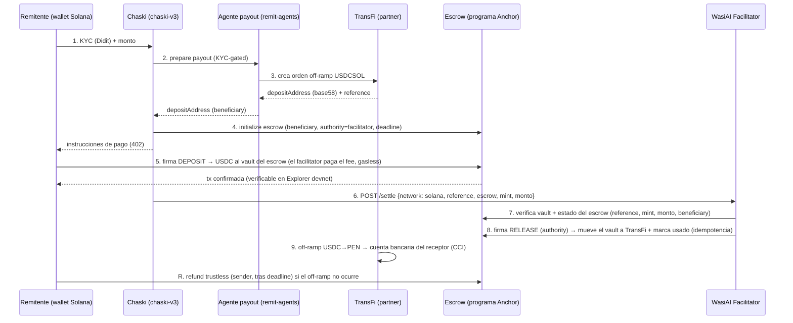

# Milestone 3 🏗️ · Arquitectura Técnica del MVP
### WasiAI A2A · Solana LATAM Labs Program (Waylearn)

> **Criterio de aceptación:** arquitectura comprensible, viable y alineada al scope del MVP.

---

## 1. El ecosistema WasiAI A2A 

WasiAI A2A es un **stack neutral multi-red** para la economía de agentes. 

```
   Objetivo NL ─▶  WasiAI A2A (cerebro/protocolo, repo wasiai-a2a)
                   ├─ Discovery        (agentes verificados, ERC-8004, cross-marketplace)
                   ├─ Orquestación     (composición multi-agente; traducción IA con Claude Sonnet)
                   ├─ Identidad         (Agent Key ERC-8004 / Kite Passport)
                   └─ Pago x402  ──────▶  WasiAI Facilitator (settlement multi-red)
                                          ┌──────────────┐   ┌────────────────────┐
                                          │ Adaptador EVM│   │ Adaptador Solana   │
                                          │ EIP-3009     │   │ SPL + reference    │
                                          │ (broadcastea)│   │ (verifica tx)      │
                                          └──────────────┘   └────────────────────┘
        ┌───────────────────────────────────────┴──────────────────────────────┐
        ▼                                                                        ▼
  Marketplace WasiAI (app.wasiai.io · AVALANCHE)                     Chaski (app · repo chaski-v3)
  · agentes publicados/descubiertos/orquestados                     · compone KYC + corredor + payout
  · cobran su FEE en su red nativa                                   · ENTREGA EL VALOR sobre SOLANA
```

**Arquitectura híbrida multi-red (la tesis neutral en acción), dos flujos de dinero:**
1. **Fees de agentes** (descubrir/orquestar/pagar KYC + FX + payout): montos chicos → liquidan en la red nativa del agente = **marketplace Avalanche** (existente).
2. **Principal de la remesa** (la entrega de valor): no-custodial → **sobre Solana**, verificado por el facilitator.

### Principio del settlement
**Solana ejecuta el pago del principal. El WasiAI Facilitator lo coordina, verifica y estandariza**: no se bypassea ni compite con Solana: **la abstrae**. Es un orquestador con **adaptadores por red**, exponiendo una sola API (`/verify`, `/settle`) para todas las cadenas, con transversales compartidos (auth · rate-limit · idempotencia · audit · ledger · métricas).

---

## 2. Componentes

| Componente | Repo / red | Rol | Estado |
|------------|------------|-----|--------|
| **WasiAI A2A (cerebro)** | `wasiai-a2a` | Discovery + orquestación/composición + traducción IA + identidad. El protocolo neutral. | Live (multi-red) |
| **Marketplace WasiAI** | `app.wasiai.io` · Avalanche | Donde los agentes se publican, descubren, orquestan y cobran su fee | Live |
| **WasiAI Facilitator** | `wasiai-facilitator` | Capa de pago: verifica, estandariza, deduplica, audita el settlement multi-red | Multi-red (adaptadores por red); se agrega el adaptador Solana |
| **Chaski (app insignia)** | `chaski-v3` · Solana | Consume la capa A2A; orquesta la remesa y **entrega el valor sobre Solana** (wallet, binding no-custodial) | VM Solana |
| **Agentes de remesa** | `wasiai-remittance-agents` | Corredor/FX (quote) + payout (off-ramp TransFi). Publicados en el marketplace | Ya VM-neutral; config Solana |
| **Partners externos** | · | Didit (KYC/AML) · TransFi (quote + off-ramp USDCSOL, PSAV licenciado) | Sandbox |

> El trabajo de ingeniería Solana del MVP toca **3 repos** (`wasiai-facilitator`, `chaski-v3`, `wasiai-remittance-agents`); las capas de discovery/orquestación/identidad (`wasiai-a2a`) y el marketplace (Avalanche) **ya existen y son chain-agnósticas**: no se rebuildean, se reutilizan.

---

## 3. User flow (remesa Chaski sobre Solana)



**Clave:** el paso 5 es **no-custodial**: el USDC va directo del remitente a la dirección del partner; WasiAI nunca lo toca. El paso 7 es donde vive el diferenciador (verificación estándar por la capa WasiAI).

---

## 4. Split on-chain / off-chain

| On-chain (Solana devnet) | Off-chain |
|--------------------------|-----------|
| **Programa escrow (Rust/Anchor)**: deposit/release/refund del USDC en un vault trustless | KYC/AML (Didit) |
| `deposit` del USDC al vault del escrow (con `reference` Solana Pay) | Quote de corredor (TransFi) |
| `release` (authority del facilitator) y `refund` (trustless, sender) | Verificación del escrow + idempotencia + auditoría (WasiAI Facilitator) |
| Confirmación de las tx (verificadas por el facilitator) | Off-ramp USDC→PEN + transferencia a cuenta bancaria/CCI (TransFi) |
| · | Orquestación (chaski-v3) + **fee-payer/gasless** (WasiAI Facilitator) |

**Nota de diseño:** el USDC no va directo a TransFi sino a un **escrow on-chain trustless**; el `release` lo firma la authority (facilitator) tras verificar, y el `refund` lo puede ejecutar el sender tras el deadline. El fee de SOL lo paga el **facilitator (gasless)**, no el usuario. La idempotencia final es la **signature/reference de la tx Solana** marcada como usada.

---

## 5. Cómo se implementa (siembra las HUs de ingeniería)

Construimos el MVP con **ports & adapters** en **5 sprints**, a calidad de producción (Épico Jira WKH-196). **El objetivo es una app lista para producción, no un demo de hackathon.** El **único track diferido es el legal**, pero sus hooks de código (Travel Rule, PII/consentimiento, límites AML) se construyen production-ready desde el MVP. Durante la incubación operamos con **dinero no real** (Solana devnet + TransFi sandbox); el paso a plata real es posterior.

**Sprint 1. Fundación**
| HU (Jira) | Repo | Qué |
|-----------|------|-----|
| HU-SOL-1 (WKH-206) | chaski-v3 | Config de red multi-VM (`chain.ts`, `VmAuthorization`, identidad por cluster) |
| HU-SOL-2 (WKH-204) | facilitator | Orquestador multichain (dispatch namespace, `SettlementAdapter`, schema discriminado) |
| HU-SOL-3 (WKH-209) | remit-agents | Off-ramp TransFi USDCSOL |
| HU-SOL-12 (WKH-215) | solana-programs | **Escrow Anchor**: state machine trustless, beneficiary fijo, refund por deadline, pitfalls |

**Sprint 2. Core Solana seguro**
| HU (Jira) | Repo | Qué |
|-----------|------|-----|
| HU-SOL-4 (WKH-212) | chaski-v3 | Integración `@solana/wallet-adapter` React |
| HU-SOL-5 (WKH-207) | chaski-v3 | Wallet Solana: `deposit` al escrow (gasless) |
| HU-SOL-6 (WKH-205) | facilitator | Adaptador Solana: verify por mint-pubkey + delta-balance + dedup **fail-closed** |
| HU-SOL-7 (WKH-213) 🔒 | chaski-v3 | Identidad base58 **sin IDOR** (canonicalización VM-aware, 15+ sitios `toLowerCase`) |

**Sprint 3. Money-path trustless + gasless seguro**
| HU (Jira) | Repo | Qué |
|-----------|------|-----|
| HU-SOL-8 (WKH-211) 🔒 | chaski-v3 | PoP **ed25519 obligatorio** + network-id CAIP-2 |
| HU-SOL-9 (WKH-208) | chaski-v3 | Binding no-custodial + wire al facilitator (release authority) |
| HU-SOL-13 (WKH-216) | chaski + facilitator | Integración del escrow (deposit/verify-vault/release/refund) |
| HU-SOL-14 (WKH-217) 🔒 | facilitator + chaski | **Gasless** con validación instrucción-por-instrucción + durable-nonce + cap |

**Sprint 4. Rieles A2A 100% op + reconciliación**
| HU (Jira) | Repo | Qué |
|-----------|------|-----|
| HU-SOL-15 (WKH-218) | chaski + a2a | **Chaski corre SOBRE los rieles** (`/orchestrate`/`/discover`, no punto-a-punto) |
| HU-SOL-16 (WKH-219) 🔒 | remit + a2a | Auth + x402 en `/invoke` + timeout/breaker + registro reproducible |
| HU-SOL-17 (WKH-220) | chaski + a2a | Reconciliación real (estado on-chain autoritativo, órfanos, cross-rail) |
| HU-SOL-18 (WKH-221) | chaski + remit | FX enforcement + reconciliación entregado-vs-cotizado |

**Sprint 5. Producción / ops / seguridad de infra**
| HU (Jira) | Repo | Qué |
|-----------|------|-----|
| HU-SOL-19 (WKH-222) 🔒 | facilitator + programs | Key management (keys separadas, multisig/timelock, KMS, upgrade authority) |
| HU-SOL-20 (WKH-223) | los 4 | RPC producción + fallback + CI + observabilidad + Redis HA |
| HU-SOL-10 (WKH-210) | facilitator | Generación del 402 intent |
| HU-SOL-11 (WKH-214) | integración | E2E devnet + deploy + smoke = entrega |

🔒 = HU con foco de seguridad (verificación reforzada).

---

## 6. Stack técnico y Clean Architecture

**Stack Solana (estándar de producción, el que corren Jupiter, Drift, Tensor, Backpack):**

| Capa | Librería | Rol |
|------|----------|-----|
| Wallet | `@solana/wallet-adapter` (react + react-ui + wallets + base) | Conexión Phantom/Solflare/Backpack (Wallet Standard) |
| Core SDK | `@solana/web3.js` v1 | Cliente Solana; máxima compatibilidad con las companion libs (`@solana/kit`/v2 como fast-follow) |
| Token | `@solana/spl-token` | Transfer de USDC + ATA (Associated Token Account) |
| Pago | `@solana/pay` | `reference` (transfer-request verificable, tracking del pago) |
| **Escrow on-chain** | **Rust + Anchor** | Programa que custodia el USDC de forma trustless (deposit/release/refund). Repo `solana-programs`. |
| **Gasless** | Fee-payer propio en el **WasiAI Facilitator** (partial-signing) | El usuario sin SOL igual envía; el facilitator paga el fee (equivalente a EIP-3009). |
| RPC | público en devnet; proveedor dedicado (Helius/Triton/QuickNode) en mainnet | Escalabilidad real de producción |

**Escrow on-chain (Rust + Anchor):** el value-delivery no va directo a TransFi sino a un **escrow on-chain** trustless (equivalente Solana-best del `WasiEscrow` de EVM). El USDC vive en un vault controlado por el programa hasta el `release` (authority del facilitator, tras KYC + orden) o el `refund` (trustless, el sender recupera tras el deadline si el off-ramp falla). Anchor da constraints de seguridad, IDL y testing. **Auditoría externa = gate antes de mainnet/plata real** (en devnet/MVP: tests + revisión de seguridad).

**Gasless (fee-payer propio):** por default en Solana el usuario paga el fee en SOL. Para que el remesante que solo tiene USDC igual pueda enviar, el **facilitator actúa de fee-payer** (partial-signing), tal como ya hace el relayer EIP-3009 en EVM. Relayer propio (no terceros), con anti-abuso: solo esponsoriza la tx esperada, rate-limited y acotada.

**Clean Architecture (hexagonal, ports & adapters), obligatoria:**
- `chaski-v3` separa dominio / aplicación / infraestructura. El contrato de firma vive en el dominio (`VmAuthorization`, unión discriminada por VM); `SolanaWallet` y el verificador son **adapters** en `infrastructure/`; aplicación y dominio quedan VM-agnósticos.
- `wasiai-facilitator` usa **ports & adapters**: el adaptador Solana es un plug-in detrás del mismo endpoint `/settle`, sin tocar `core/` ni los transversales (auth, rate-limit, idempotencia, auditoría).
- Beneficio concreto (dependency inversion): el SDK es un detalle reemplazable. Migrar de `web3.js` v1 a v2/`@solana/kit` mañana es un swap dentro de `infrastructure/`, sin tocar la lógica de negocio.

---

## 7. Riesgos y mitigaciones

| Riesgo | Mitigación |
|--------|------------|
| El modelo de firma Solana (ed25519) difiere del modelo con relayer | Adaptador Solana dedicado; el facilitator ya tiene patrón de adaptadores por red |
| Doble-gasto / replay de una tx confirmada | Idempotencia por signature/reference marcada usada (Redis + ledger) |
| Desvío de fondos (inyectar otro destino) | El `to` == depositAddress atestada; verificación server-side; rechazo si no matchea (pre-broadcast) |
| Corredor Solana del partner no habilitado en sandbox | Confirmar `USDCSOL` en TransFi sandbox (dependencia founder) |
| Romper adaptadores de otras redes al generalizar | AC de compatibilidad + suite de regresión en facilitator y chaski |
| Sin plata real ≠ demo creíble | Solana devnet da tx **reales y verificables en Explorer** + sandboxes de partners → integración real, cero plata real |

---

## 8. Deploy

- `wasiai-facilitator` → Railway (Fastify). Dispatch multi-red por **namespace** (`solana:devnet`/`solana:mainnet`), ya en prod; el adaptador Solana concreto (HU-SOL-6) sumará `SOLANA_RPC_URL` + `SOLANA_USDC_MINT`.
- `chaski-v3` → Vercel (Next.js). Env nuevas: `NEXT_PUBLIC_VM` (default `evm`), `NEXT_PUBLIC_SOLANA_USDC_MINT`, `SOLANA_DEVNET_RPC_URL`. Deps: `@solana/web3.js`, `@solana/spl-token`, `@solana/pay`.
- `wasiai-remittance-agents` → Vercel. Config: `TRANSFI_USDC_NETWORK=solana` (→ `USDCSOL`).
- Flags nuevas **OFF por default** (se encienden para el e2e de M5).

---

*Sprint S0 (catch-up). Milestone 3 del Solana LATAM Labs. Siembra las HUs (Track B). Entregable → carpeta Drive. Jira: WKH-199.*